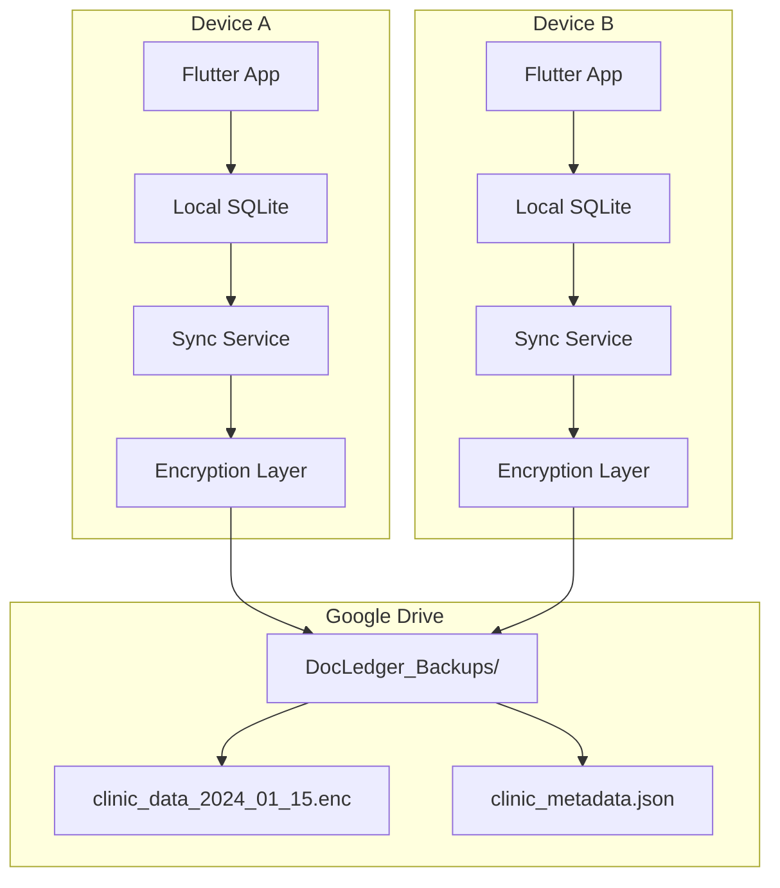
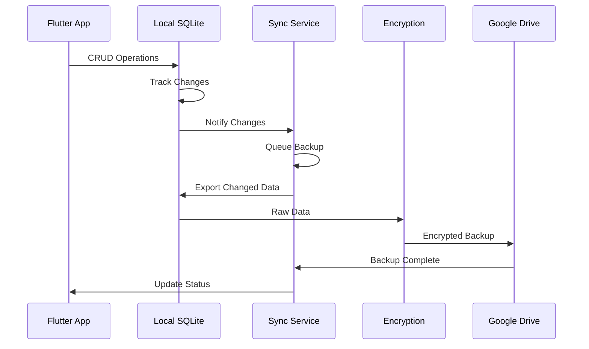

# Design Document

## Overview

The DocLedger Data Synchronization and Backup System implements a robust offline-first architecture with Google Drive integration for backup and multi-device synchronization. The system maintains local SQLite as the primary data store while providing seamless cloud backup and conflict-free synchronization across multiple devices per clinic.

The design follows a layered architecture with clear separation of concerns:
- **Presentation Layer**: UI components for sync status and settings
- **Business Logic Layer**: Sync orchestration and conflict resolution
- **Data Access Layer**: Local SQLite operations with change tracking
- **Cloud Integration Layer**: Google Drive API interactions and encryption
- **Background Services**: Automated sync and backup scheduling

## Architecture

### High-Level Architecture Diagram



### Data Flow Architecture



## Components and Interfaces

### 1. Core Data Layer

#### SQLite Database Schema Enhancement
```sql
-- Add sync tracking to existing tables
ALTER TABLE patients ADD COLUMN last_modified INTEGER;
ALTER TABLE patients ADD COLUMN sync_status TEXT DEFAULT 'pending';
ALTER TABLE patients ADD COLUMN device_id TEXT;

ALTER TABLE visits ADD COLUMN last_modified INTEGER;
ALTER TABLE visits ADD COLUMN sync_status TEXT DEFAULT 'pending';
ALTER TABLE visits ADD COLUMN device_id TEXT;

ALTER TABLE payments ADD COLUMN last_modified INTEGER;
ALTER TABLE payments ADD COLUMN sync_status TEXT DEFAULT 'pending';
ALTER TABLE payments ADD COLUMN device_id TEXT;

-- Sync metadata table
CREATE TABLE sync_metadata (
    id INTEGER PRIMARY KEY,
    table_name TEXT NOT NULL,
    last_sync_timestamp INTEGER,
    last_backup_timestamp INTEGER,
    pending_changes_count INTEGER DEFAULT 0,
    conflict_count INTEGER DEFAULT 0
);

-- Conflict resolution table
CREATE TABLE sync_conflicts (
    id INTEGER PRIMARY KEY,
    table_name TEXT NOT NULL,
    record_id TEXT NOT NULL,
    local_data TEXT,
    remote_data TEXT,
    conflict_timestamp INTEGER,
    resolution_status TEXT DEFAULT 'pending',
    resolved_data TEXT
);
```

#### Database Service Interface
```dart
abstract class DatabaseService {
  Future<void> initialize();
  Future<List<Map<String, dynamic>>> getChangedRecords(String tableName, int sinceTimestamp);
  Future<void> markRecordsSynced(String tableName, List<String> recordIds);
  Future<void> applyRemoteChanges(String tableName, List<Map<String, dynamic>> records);
  Future<ConflictResolution> resolveConflicts(List<SyncConflict> conflicts);
  Future<Map<String, dynamic>> exportDatabaseSnapshot();
  Future<void> importDatabaseSnapshot(Map<String, dynamic> snapshot);
}
```

### 2. Google Drive Integration Layer

#### Google Drive Service
```dart
class GoogleDriveService {
  final GoogleSignIn _googleSignIn;
  final DriveApi _driveApi;
  
  Future<bool> authenticate();
  Future<void> refreshTokens();
  Future<String> uploadBackupFile(String fileName, List<int> encryptedData);
  Future<List<int>> downloadBackupFile(String fileId);
  Future<List<DriveFile>> listBackupFiles();
  Future<void> deleteOldBackups(int retentionDays);
  Future<DriveFile> getLatestBackup();
}
```

#### Required Dependencies
```yaml
dependencies:
  google_sign_in: ^6.2.1
  googleapis: ^13.2.0
  googleapis_auth: ^1.6.0
  http: ^1.2.0
```

### 3. Encryption and Security Layer

#### Encryption Service
```dart
class EncryptionService {
  static const String _algorithm = 'AES-256-GCM';
  
  Future<List<int>> encryptData(Map<String, dynamic> data, String password);
  Future<Map<String, dynamic>> decryptData(List<int> encryptedData, String password);
  String generateDeviceId();
  Future<String> deriveEncryptionKey(String clinicId, String deviceId);
  Future<bool> validateDataIntegrity(List<int> data, String checksum);
}
```

#### Required Dependencies
```yaml
dependencies:
  crypto: ^3.0.3
  encrypt: ^5.0.3
  device_info_plus: ^10.1.2
```

### 4. Synchronization Orchestrator

#### Sync Service Architecture
```dart
class SyncService {
  final DatabaseService _database;
  final GoogleDriveService _driveService;
  final EncryptionService _encryption;
  final ConnectivityService _connectivity;
  
  // Core sync operations
  Future<SyncResult> performFullSync();
  Future<SyncResult> performIncrementalSync();
  Future<BackupResult> createBackup();
  Future<RestoreResult> restoreFromBackup(String backupFileId);
  
  // Conflict resolution
  Future<void> resolveConflicts(ConflictResolutionStrategy strategy);
  
  // Background operations
  void schedulePeriodicSync();
  void scheduleBackupOnChanges();
}
```

#### Sync State Management
```dart
enum SyncStatus { idle, syncing, backing_up, restoring, error }

class SyncState {
  final SyncStatus status;
  final DateTime? lastSyncTime;
  final DateTime? lastBackupTime;
  final int pendingChanges;
  final List<SyncConflict> conflicts;
  final String? errorMessage;
  final double? progress;
}
```

### 5. Background Services

#### Background Task Service
```dart
class BackgroundSyncService {
  static const String _taskId = 'docledger_sync';
  
  Future<void> registerBackgroundTasks();
  Future<void> scheduleImmediateSync();
  Future<void> schedulePeriodicBackup();
  Future<void> handleConnectivityChange(bool isConnected);
}
```

#### Required Dependencies
```yaml
dependencies:
  workmanager: ^0.5.2
  connectivity_plus: ^6.0.5
```

### 6. User Interface Components

#### Sync Status Widget
```dart
class SyncStatusWidget extends StatelessWidget {
  final SyncState syncState;
  final VoidCallback onManualSync;
  final VoidCallback onSettings;
  
  @override
  Widget build(BuildContext context) {
    return Card(
      child: ListTile(
        leading: _buildStatusIcon(),
        title: Text(_getStatusText()),
        subtitle: Text(_getLastSyncText()),
        trailing: _buildActionButton(),
      ),
    );
  }
}
```

#### Sync Settings Page
```dart
class SyncSettingsPage extends StatefulWidget {
  @override
  _SyncSettingsPageState createState() => _SyncSettingsPageState();
}

class _SyncSettingsPageState extends State<SyncSettingsPage> {
  bool _autoBackupEnabled = true;
  bool _wifiOnlySync = true;
  int _backupFrequencyMinutes = 30;
  
  Widget build(BuildContext context) {
    return Scaffold(
      appBar: AppBar(title: Text('Sync & Backup Settings')),
      body: _buildSettingsForm(),
    );
  }
}
```

## Data Models

### Sync-Enhanced Data Models

#### Patient Model with Sync Support
```dart
class Patient {
  final String id;
  final String name;
  final String phone;
  final DateTime? dateOfBirth;
  final DateTime lastModified;
  final String syncStatus;
  final String deviceId;
  
  Map<String, dynamic> toSyncJson() {
    return {
      'id': id,
      'name': name,
      'phone': phone,
      'date_of_birth': dateOfBirth?.toIso8601String(),
      'last_modified': lastModified.millisecondsSinceEpoch,
      'device_id': deviceId,
    };
  }
  
  static Patient fromSyncJson(Map<String, dynamic> json) {
    return Patient(
      id: json['id'],
      name: json['name'],
      phone: json['phone'],
      dateOfBirth: json['date_of_birth'] != null 
          ? DateTime.parse(json['date_of_birth']) 
          : null,
      lastModified: DateTime.fromMillisecondsSinceEpoch(json['last_modified']),
      syncStatus: 'synced',
      deviceId: json['device_id'],
    );
  }
}
```

#### Backup File Structure
```dart
class BackupData {
  final String clinicId;
  final String deviceId;
  final DateTime timestamp;
  final int version;
  final Map<String, List<Map<String, dynamic>>> tables;
  final String checksum;
  
  Map<String, dynamic> toJson() {
    return {
      'clinic_id': clinicId,
      'device_id': deviceId,
      'timestamp': timestamp.toIso8601String(),
      'version': version,
      'tables': tables,
      'checksum': checksum,
    };
  }
}
```

### Conflict Resolution Models

```dart
class SyncConflict {
  final String id;
  final String tableName;
  final String recordId;
  final Map<String, dynamic> localData;
  final Map<String, dynamic> remoteData;
  final DateTime conflictTime;
  final ConflictType type;
  
  enum ConflictType { update_conflict, delete_conflict, create_conflict }
}

class ConflictResolution {
  final String conflictId;
  final ResolutionStrategy strategy;
  final Map<String, dynamic> resolvedData;
  
  enum ResolutionStrategy { use_local, use_remote, merge, manual }
}
```

## Error Handling

### Error Types and Recovery Strategies

#### Network and API Errors
```dart
class SyncErrorHandler {
  static Future<SyncResult> handleNetworkError(NetworkException error) async {
    switch (error.type) {
      case NetworkErrorType.no_internet:
        return SyncResult.deferred('No internet connection');
      case NetworkErrorType.api_rate_limit:
        return SyncResult.retry(delay: Duration(minutes: 5));
      case NetworkErrorType.authentication_failed:
        return SyncResult.requiresReauth();
      case NetworkErrorType.insufficient_storage:
        return SyncResult.error('Google Drive storage full');
    }
  }
}
```

#### Data Integrity Errors
```dart
class DataIntegrityHandler {
  static Future<void> handleCorruptedBackup(String backupFileId) async {
    // Try previous backup
    final previousBackups = await _driveService.listBackupFiles();
    for (final backup in previousBackups.skip(1)) {
      try {
        await _syncService.restoreFromBackup(backup.id);
        return;
      } catch (e) {
        continue;
      }
    }
    throw DataCorruptionException('All backups are corrupted');
  }
}
```

### Retry Logic and Exponential Backoff
```dart
class RetryPolicy {
  static const List<Duration> backoffDelays = [
    Duration(seconds: 5),
    Duration(seconds: 15),
    Duration(minutes: 1),
    Duration(minutes: 5),
    Duration(minutes: 15),
  ];
  
  static Future<T> executeWithRetry<T>(
    Future<T> Function() operation,
    {int maxRetries = 3}
  ) async {
    for (int attempt = 0; attempt <= maxRetries; attempt++) {
      try {
        return await operation();
      } catch (e) {
        if (attempt == maxRetries) rethrow;
        await Future.delayed(backoffDelays[attempt]);
      }
    }
    throw Exception('Max retries exceeded');
  }
}
```

## Testing Strategy

### Unit Testing Approach

#### Database Layer Tests
```dart
group('DatabaseService Tests', () {
  late DatabaseService databaseService;
  
  setUp(() async {
    databaseService = await DatabaseService.createInMemory();
  });
  
  test('should track changes when records are modified', () async {
    // Test change tracking functionality
  });
  
  test('should resolve conflicts using timestamp strategy', () async {
    // Test conflict resolution logic
  });
});
```

#### Sync Service Tests
```dart
group('SyncService Tests', () {
  late MockGoogleDriveService mockDriveService;
  late MockDatabaseService mockDatabase;
  late SyncService syncService;
  
  setUp(() {
    mockDriveService = MockGoogleDriveService();
    mockDatabase = MockDatabaseService();
    syncService = SyncService(mockDatabase, mockDriveService);
  });
  
  test('should handle network failures gracefully', () async {
    when(mockDriveService.uploadBackupFile(any, any))
        .thenThrow(NetworkException());
    
    final result = await syncService.createBackup();
    expect(result.status, SyncStatus.error);
  });
});
```

### Integration Testing

#### End-to-End Sync Flow Tests
```dart
group('E2E Sync Tests', () {
  testWidgets('should sync data between two devices', (tester) async {
    // Simulate two devices with same clinic account
    final device1 = await createTestDevice('device1');
    final device2 = await createTestDevice('device2');
    
    // Add patient on device1
    await device1.addPatient(testPatient);
    await device1.sync();
    
    // Sync on device2 and verify patient exists
    await device2.sync();
    final patients = await device2.getPatients();
    expect(patients, contains(testPatient));
  });
});
```

### Performance Testing

#### Sync Performance Benchmarks
```dart
group('Performance Tests', () {
  test('should sync 1000 records within 30 seconds', () async {
    final stopwatch = Stopwatch()..start();
    
    // Create 1000 test records
    final records = List.generate(1000, (i) => createTestPatient(i));
    await database.insertPatients(records);
    
    // Perform sync
    await syncService.performFullSync();
    
    stopwatch.stop();
    expect(stopwatch.elapsed.inSeconds, lessThan(30));
  });
});
```

## Security Considerations

### Data Encryption Strategy

#### Client-Side Encryption
- All data encrypted before leaving the device using AES-256-GCM
- Encryption keys derived from clinic ID and device-specific salt
- No plaintext patient data stored in Google Drive

#### Key Management
```dart
class KeyManager {
  static Future<String> deriveKey(String clinicId, String deviceSalt) async {
    final combined = '$clinicId:$deviceSalt';
    final bytes = utf8.encode(combined);
    final digest = sha256.convert(bytes);
    return base64.encode(digest.bytes);
  }
  
  static Future<void> rotateKeys() async {
    // Implement key rotation for enhanced security
  }
}
```

### Authentication Security
- OAuth2 tokens stored in secure device storage
- Automatic token refresh with fallback to re-authentication
- Support for multiple Google accounts per device

### Data Privacy Compliance
- No PII transmitted in plaintext
- Audit logging for all sync operations
- User consent for cloud backup operations
- Data retention policies enforced automatically

## Performance Optimization

### Database Optimization
- Indexed columns for sync queries
- Batch operations for large data sets
- Connection pooling for concurrent operations
- Vacuum operations during idle periods

### Network Optimization
- Compression of backup files before encryption
- Delta sync for incremental updates
- Intelligent retry with exponential backoff
- WiFi-preferred sync to minimize data usage

### Memory Management
- Streaming for large backup files
- Lazy loading of sync metadata
- Proper disposal of resources
- Background processing for non-critical operations

## Monitoring and Logging

### Sync Metrics Collection
```dart
class SyncMetrics {
  static void recordSyncDuration(Duration duration) {
    // Record sync performance metrics
  }
  
  static void recordConflictResolution(ConflictType type, ResolutionStrategy strategy) {
    // Track conflict resolution patterns
  }
  
  static void recordBackupSize(int bytes) {
    // Monitor backup file sizes
  }
}
```

### Error Logging and Reporting
```dart
class SyncLogger {
  static void logSyncStart(String deviceId) {
    // Log sync operation start
  }
  
  static void logSyncError(String error, StackTrace stackTrace) {
    // Log detailed error information
  }
  
  static void logConflictResolution(SyncConflict conflict, ConflictResolution resolution) {
    // Log conflict resolution details
  }
}
```

This design provides a robust, scalable, and secure foundation for implementing the data synchronization and backup system while maintaining the offline-first approach that's critical for clinic operations.